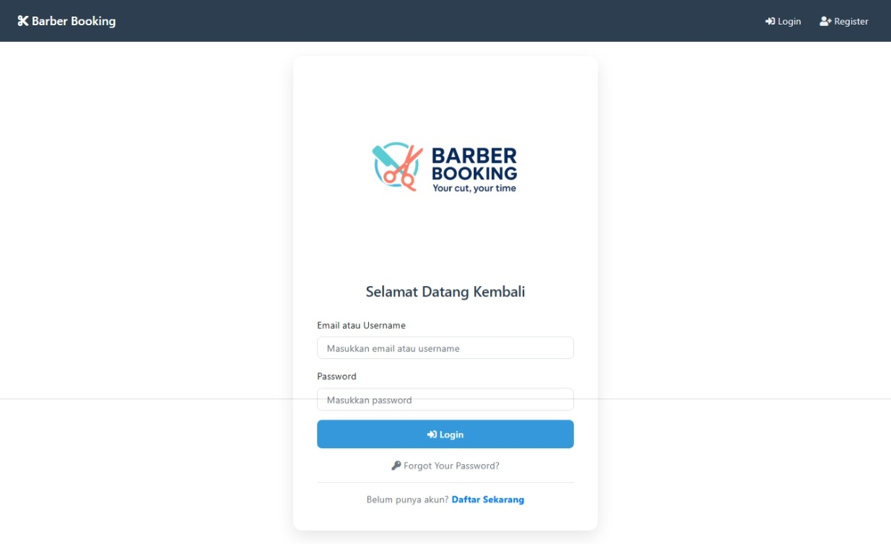
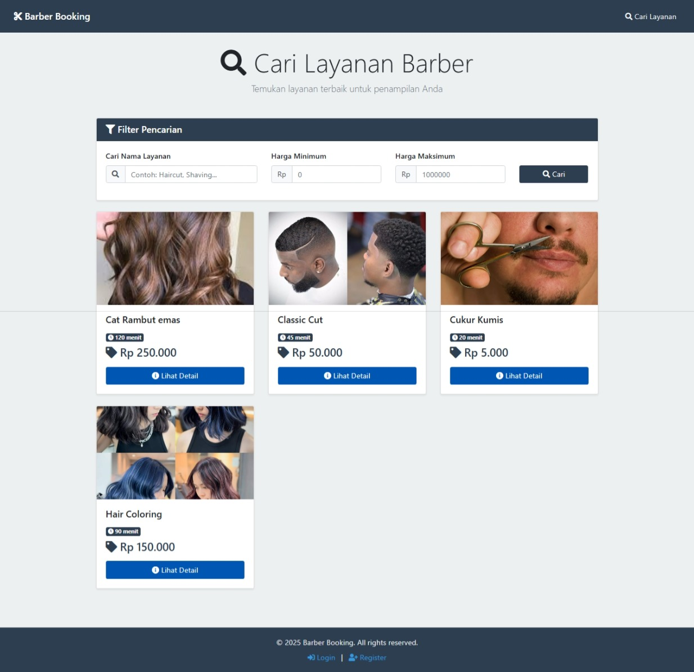
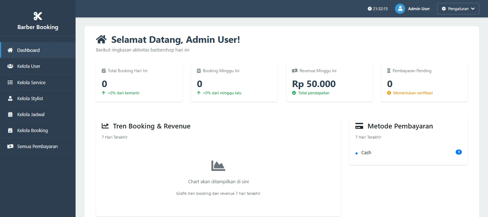
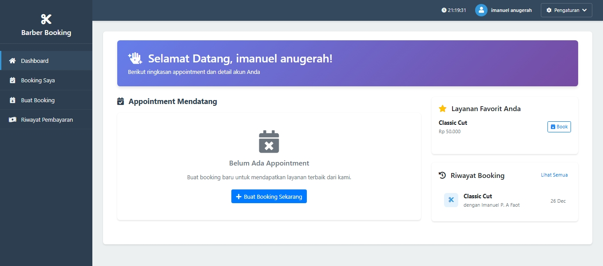
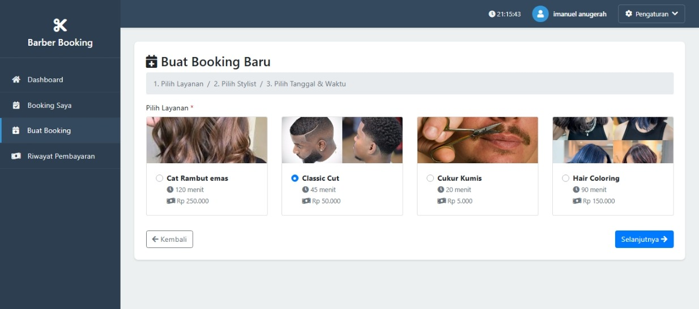

# 💈 Barber Booking System

<p align="center">
  
</p>

<p align="center">
  <strong>Aplikasi Booking Barbershop Berbasis Web</strong><br>
  Sistem manajemen booking barbershop yang modern, user-friendly, dan feature-rich
</p>

<p align="center">
  
  
  
  
</p>

---

## 📋 Daftar Isi

- [Tentang Project](#-tentang-project)
- [Fitur Utama](#-fitur-utama)
- [Tech Stack](#-tech-stack)
- [Persyaratan Sistem](#-persyaratan-sistem)
- [Instalasi](#-instalasi)
- [Konfigurasi](#-konfigurasi)
- [User Roles](#-user-roles)
- [Struktur Direktori](#-struktur-direktori)
- [API Documentation](#-api-documentation)
- [Screenshots](#-screenshots)
- [Troubleshooting](#-troubleshooting)
- [Contributing](#-contributing)
- [License](#-license)
- [Credits](#-credits)

---

## 🎯 Tentang Project

**Barber Booking System** adalah aplikasi web fullstack untuk manajemen booking barbershop yang dibangun sebagai Mini Project mata kuliah **Pemrograman Web Lanjut (PWL)**. Aplikasi ini menyediakan solusi lengkap untuk mengelola layanan barbershop, jadwal stylist, booking pelanggan, hingga pembayaran online.

### Kenapa Barber Booking?

- ✅ **User-Friendly**: Interface yang intuitif dan mudah digunakan
- ✅ **Multi-Role**: Mendukung Admin, Stylist, dan Customer dengan hak akses berbeda
- ✅ **Responsive Design**: Dapat diakses dari desktop maupun mobile
- ✅ **Real-time Slot Checking**: Cek ketersediaan jadwal secara realtime
- ✅ **Payment Gateway**: Integrasi dengan Midtrans untuk pembayaran online
- ✅ **Email Verification**: Sistem registrasi dengan verifikasi email 6-digit
- ✅ **RESTful API**: API endpoints untuk integrasi dengan aplikasi lain

---

## ✨ Fitur Utama

### 👥 Manajemen User
- Multi-step registration dengan email verification (6-digit code)
- Login/Logout dengan session management
- Role-based access control (Admin, Stylist, Customer)
- User profile management dengan upload foto
- Change password functionality

### 💼 Manajemen Admin
- Dashboard dengan statistik lengkap
- CRUD Users (Create, Read, Update, Delete)
- CRUD Services (Layanan barbershop)
- CRUD Stylists (Manajemen data stylist)
- CRUD Schedules (Jadwal kerja stylist)
- Booking management (Confirm, Complete, Cancel)
- Payment monitoring

### 💇 Fitur Stylist
- Dashboard khusus stylist
- Melihat jadwal booking sendiri
- Update status booking (Complete/Cancel)
- Melihat riwayat layanan

### 👤 Fitur Customer
- Dashboard pribadi dengan booking history
- Browse layanan barbershop (tanpa login)
- Filter layanan berdasarkan nama dan harga
- Pilih layanan favorit
- Pilih stylist berdasarkan spesialisasi
- Pilih tanggal dan waktu booking
- Cek slot tersedia secara realtime
- Payment methods:
  - Cash payment ✅
  - Midtrans payment gateway 🚧 *(Coming Soon - Next Implementation)*
- Download receipt pembayaran
- Cancel booking

### 🌐 Fitur Visitor (Guest)
- Halaman landing dengan search service
- Filter layanan (nama, harga min/max)
- View service detail tanpa login
- Related services recommendations
- Call-to-action untuk register/login

### 🔌 RESTful API
- Public API:
  - `GET /api/v1/services` - List semua services
  - `GET /api/v1/services/{id}` - Detail service
  - `GET /api/v1/stylists` - List semua stylists
  - `GET /api/v1/stylists/{id}` - Detail stylist
- Protected API (require authentication):
  - `GET /api/v1/bookings` - List bookings (role-based)
  - `GET /api/v1/bookings/{id}` - Detail booking

---

## 🛠 Tech Stack

### Backend
- **Framework**: Laravel 6.x
- **Language**: PHP 7.2+
- **Database**: MySQL 5.7+ / MariaDB
- **Authentication**: Laravel Auth + Session
- **Email**: Laravel Mail + SMTP

### Frontend
- **CSS Framework**: Bootstrap 4.6
- **Icons**: Font Awesome 5.15
- **JavaScript**: jQuery, SweetAlert2
- **Template Engine**: Blade

### Payment Gateway
- **Cash Payment**: Manual payment tracking ✅
- **Midtrans**: Payment gateway integration 🚧 *(Planned for next implementation)*

### Development Tools
- **Composer**: PHP dependency management
- **NPM**: Frontend dependency management
- **Laravel Mix**: Asset compilation

---

## 💻 Persyaratan Sistem

Pastikan sistem Anda memenuhi persyaratan berikut:

- PHP >= 7.2.5 (Recommended: PHP 8.0)
- Composer
- MySQL >= 5.7 atau MariaDB
- Apache/Nginx web server
- Node.js >= 12.x dan NPM (untuk kompilasi assets)
- Extension PHP yang diperlukan:
  - BCMath
  - Ctype
  - JSON
  - Mbstring
  - OpenSSL
  - PDO
  - Tokenizer
  - XML

---

## 📦 Instalasi

### 1. Clone Repository

```bash
git clone https://github.com/username/barber-booking.git
cd barber-booking
```

### 2. Install Dependencies

```bash
# Install PHP dependencies
composer install

# Install Node dependencies
npm install
```

### 3. Environment Setup

```bash
# Copy .env.example ke .env
cp .env.example .env  # Linux/Mac
copy .env.example .env  # Windows

# Generate application key
php artisan key:generate
```

### 4. Database Configuration

Edit file `.env` dan sesuaikan konfigurasi database:

```env
DB_CONNECTION=mysql
DB_HOST=127.0.0.1
DB_PORT=3306
DB_DATABASE=barber_booking
DB_USERNAME=root
DB_PASSWORD=
```

### 5. Database Migration & Seeding

```bash
# Buat database terlebih dahulu
mysql -u root -p
CREATE DATABASE barber_booking;
EXIT;

# Jalankan migration
php artisan migrate

# (Optional) Seed database dengan data dummy
php artisan db:seed
```

### 6. Storage Link

```bash
# Buat symbolic link untuk storage
php artisan storage:link
```

### 7. Compile Assets

```bash
# Development
npm run dev

# Production
npm run production
```

### 8. Run Application

```bash
# Jalankan development server
php artisan serve
```

Aplikasi dapat diakses di: `http://localhost:8000`

---

## ⚙️ Konfigurasi

### Mail Configuration (Email Verification)

Edit `.env` untuk konfigurasi email:

```env
MAIL_MAILER=smtp
MAIL_HOST=smtp.gmail.com
MAIL_PORT=587
MAIL_USERNAME=your-email@gmail.com
MAIL_PASSWORD=your-app-password
MAIL_ENCRYPTION=tls
MAIL_FROM_ADDRESS=your-email@gmail.com
MAIL_FROM_NAME="${APP_NAME}"
```

**Catatan**: Untuk Gmail, gunakan App Password, bukan password akun biasa.

### Midtrans Configuration (Payment Gateway) 🚧

> **Note**: Midtrans payment gateway merupakan fitur yang akan diimplementasikan pada fase selanjutnya. Saat ini sistem menggunakan cash payment.

Untuk implementasi Midtrans di masa depan, edit `.env`:

```env
MIDTRANS_SERVER_KEY=your-server-key
MIDTRANS_CLIENT_KEY=your-client-key
MIDTRANS_IS_PRODUCTION=false
MIDTRANS_IS_SANITIZED=true
MIDTRANS_IS_3DS=true
```

Dapatkan API keys dari [Midtrans Dashboard](https://dashboard.midtrans.com/)

---

## 👥 User Roles

### 1. Admin
**Email**: admin@barber.com
**Password**: password

**Akses**:
- Full access ke semua fitur
- Manajemen users, services, stylists, schedules
- Monitoring semua booking dan payments
- Dashboard dengan statistik lengkap

### 2. Stylist
**Email**: stylist@barber.com
**Password**: password

**Akses**:
- View dan manage booking yang ditugaskan
- Update status booking
- View jadwal kerja sendiri
- Dashboard khusus stylist

### 3. Customer
**Email**: customer@barber.com
**Password**: password

**Akses**:
- Browse dan search services
- Create booking
- Choose stylist dan waktu
- Make payment
- View booking history
- Cancel booking

### 4. Guest/Visitor
Tanpa login:
- Browse services
- View service details
- Filter services
- View related services

---

## 📁 Struktur Direktori

```
barber-booking/
├── app/
│   ├── Http/
│   │   └── Controllers/
│   │       ├── Api/
│   │       │   └── ApiController.php          # API endpoints
│   │       ├── Admin/
│   │       │   └── BookingManagementController.php
│   │       ├── Auth/
│   │       │   └── RegisterController.php     # Multi-step registration
│   │       ├── BookingController.php          # Customer booking
│   │       ├── DashboardController.php        # Role-based dashboards
│   │       ├── PaymentController.php          # Payment & Midtrans
│   │       ├── ServiceController.php          # CRUD Services
│   │       ├── StylistController.php          # CRUD Stylists
│   │       ├── UserController.php             # CRUD Users
│   │       ├── VisitorController.php          # Guest pages
│   │       └── PasswordController.php         # Change password
│   ├── Models/
│   │   ├── User.php
│   │   ├── Service.php
│   │   ├── Stylist.php
│   │   ├── Booking.php
│   │   ├── Payment.php
│   │   └── Schedule.php
│   └── Mail/
│       └── RegistrationVerification.php       # Email verification
├── database/
│   ├── migrations/                            # Database schemas
│   └── seeds/                                 # Database seeders
├── resources/
│   └── views/
│       ├── admin/                             # Admin views
│       ├── auth/                              # Authentication views
│       ├── bookings/                          # Booking views
│       ├── dashboard/                         # Dashboard views
│       ├── payments/                          # Payment views
│       ├── services/                          # Service CRUD views
│       ├── stylists/                          # Stylist CRUD views
│       ├── users/                             # User CRUD views
│       ├── visitor/                           # Guest/visitor views
│       └── layouts/
│           ├── app.blade.php                  # Main layout
│           └── visitor.blade.php              # Visitor layout
├── routes/
│   ├── web.php                                # Web routes
│   └── api.php                                # API routes
├── public/
│   ├── images/
│   │   └── no-image.jpg                       # Default image placeholder
│   └── storage/                               # Uploaded files (symlink)
└── storage/
    └── app/
        └── public/                            # File uploads
```

---

## 🔌 API Documentation

### Base URL
```
http://localhost:8000/api/v1
```

### Public Endpoints

#### Get All Services
```http
GET /services
```

**Query Parameters**:
- `search` (optional): Filter by service name
- `min_price` (optional): Minimum price
- `max_price` (optional): Maximum price

**Response**:
```json
{
  "success": true,
  "data": [
    {
      "id": 1,
      "name": "Haircut",
      "duration_minutes": 30,
      "price": 50000,
      "image": "services/haircut.jpg",
      "is_active": true
    }
  ]
}
```

#### Get Service by ID
```http
GET /services/{id}
```

#### Get All Stylists
```http
GET /stylists
```

#### Get Stylist by ID
```http
GET /stylists/{id}
```

### Protected Endpoints (Require Authentication)

#### Get Bookings
```http
GET /bookings
Authorization: Bearer {token}
```

#### Get Booking by ID
```http
GET /bookings/{id}
Authorization: Bearer {token}
```

---

## 📸 Screenshots

### Landing Page (Visitor)


### Service Search & Filter


### Admin Dashboard


### Customer Dashboard


### Booking Process



---

## 🔧 Troubleshooting

### Issue: Error 500 saat akses halaman

**Solusi**:
```bash
# Clear cache
php artisan cache:clear
php artisan config:clear
php artisan route:clear
php artisan view:clear

# Set proper permissions
chmod -R 775 storage
chmod -R 775 bootstrap/cache
```

### Issue: Gambar tidak muncul

**Solusi**:
```bash
# Buat symbolic link
php artisan storage:link

# Pastikan folder storage/app/public ada
mkdir -p storage/app/public/services
mkdir -p storage/app/public/users
```

### Issue: Email verification tidak terkirim

**Solusi**:
- Pastikan konfigurasi email di `.env` sudah benar
- Untuk Gmail, gunakan App Password
- Cek log di `storage/logs/laravel.log`

### Issue: Payment gateway tidak tersedia

**Info**:
- Saat ini sistem menggunakan cash payment
- Midtrans payment gateway akan diimplementasikan pada fase selanjutnya
- Payment dapat di-update statusnya oleh admin setelah customer melakukan pembayaran cash

---

## 🤝 Contributing

Kontribusi sangat diterima! Untuk berkontribusi:

1. Fork repository ini
2. Buat branch fitur baru (`git checkout -b feature/AmazingFeature`)
3. Commit perubahan (`git commit -m 'Add some AmazingFeature'`)
4. Push ke branch (`git push origin feature/AmazingFeature`)
5. Buat Pull Request

### Coding Standards

- Follow PSR-2 coding standards
- Write meaningful commit messages
- Add comments untuk logic yang complex
- Update documentation bila diperlukan

---

### Developed By
**Imanuel Putra**
Pemrograman Web Lanjut (PWL)
[GitHub](https://github.com/Im-A-Nuel) | [Email](imanuel.putra@ti.ukdw.ac.id)

### Built With
- [Laravel](https://laravel.com/) - The PHP Framework
- [Bootstrap](https://getbootstrap.com/) - CSS Framework
- [Font Awesome](https://fontawesome.com/) - Icon Library
- [SweetAlert2](https://sweetalert2.github.io/) - Beautiful Alerts
- [Midtrans](https://midtrans.com/) - Payment Gateway
- [jQuery](https://jquery.com/) - JavaScript Library

### Special Thanks
- Dosen Pemrograman Web Lanjut
- [Laravel Documentation](https://laravel.com/docs/6.x)
- [Stack Overflow Community](https://stackoverflow.com/)
- Claude AI Assistant

---

<p align="center">
  <sub>© 2025 Barber Booking System. All rights reserved.</sub>
</p>
